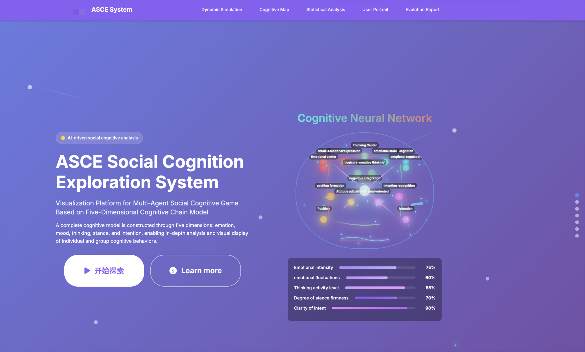
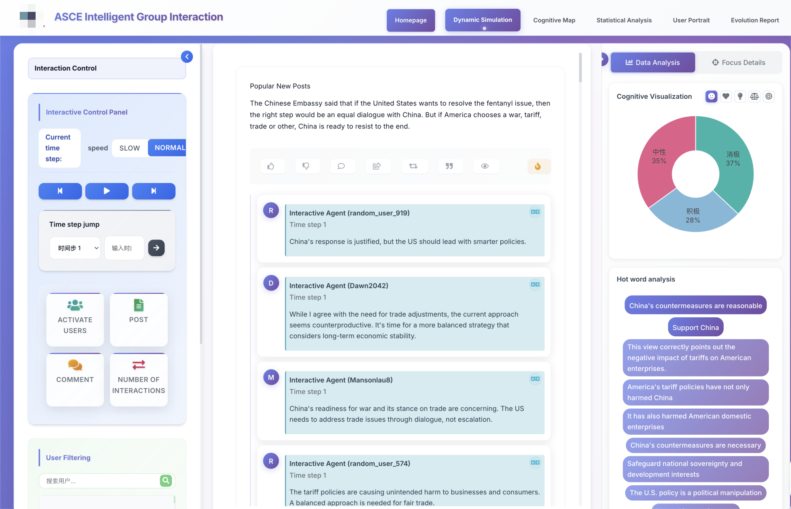
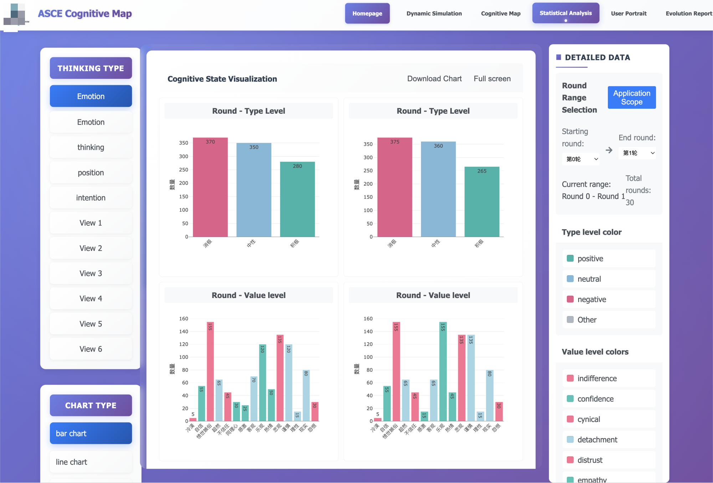
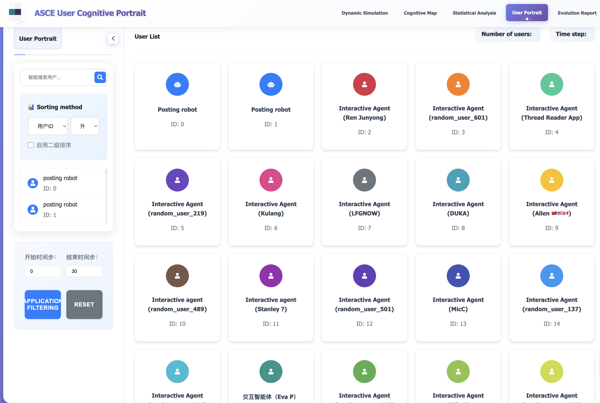
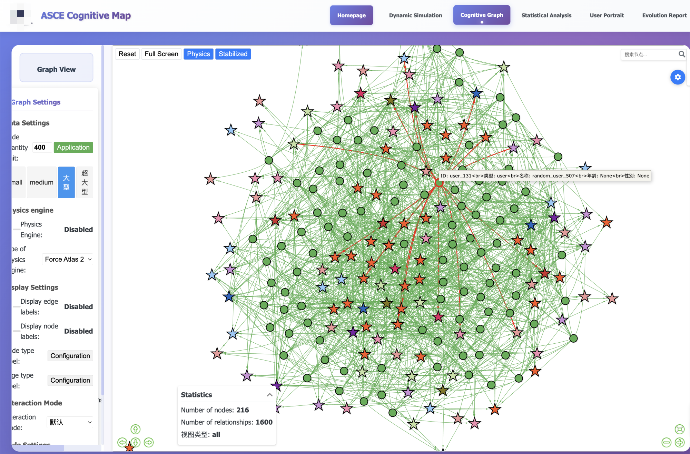

# ASCE: Agent-based Social Cognition Evolution

**A Simulation and Analysis Platform for Social Media Research with Cognitive Traceability**

## Overview

ASCE (Agent-based Social Cognition Evolution) is the first simulation and analysis platform designed for social media research that supports "cognitive traceability." While traditional multi-agent systems focus on replicating observable behaviors, ASCE opens the "cognitive black box" to reveal why users act the way they do.

The rise of social media has profoundly reshaped information dissemination, public opinion formation, and collective action. Understanding user behavior and its underlying psychological mechanisms is crucial for both social science research and public governance. However, the inherent complexity of online environments poses significant modeling challenges. ASCE addresses these challenges by providing an integrated system for behavioral simulation, cognitive modeling, and visual analytics.


## System Architecture

ASCE consists of five core, collaborating modules working across three distinct phases:

### Phase 1: Registration
- **Data Collection**: Collects and structures foundational data including posts and user information
- **Agent Registration**: Creates personalized basic profiles for each agent
- **Cognitive Profiling**: Uses LLM analysis to construct multi-dimensional cognitive profiles

### Phase 2: Simulation
- **Environment Server**: Maintains the state and data of the entire platform
- **Recommendation System**: Generates personalized content feeds using hybrid recommendation strategy
- **Agent Module**: Enables agents to perform 17 distinct behaviors (liking, commenting, following, etc.)
- **Cognitive Reasoning Chain**: Dynamically updates agent cognitive states through the Mood-Emotion-Thinking-Stance-Intention pathway

### Phase 3: Analysis
- **Data Capture**: Records all interaction and cognitive state data
- **Visual Analytics**: Multi-dimensional analysis through interactive web interface


## Visual Analytics Platform

The ASCE system features a comprehensive web-based analysis interface with five specialized pages:

### 1. Homepage


The homepage provides a comprehensive overview of the ASCE system, introducing its core concepts, methodology, and key features. It serves as the entry point for researchers to understand the platform's capabilities in cognitive-traceable social media simulation.

### 2. Multi-Agent Interaction Page


This page presents the core simulation environment where agents interact. Users can observe agents performing various social media behaviors including:
- **Posting and sharing content**
- **Commenting and replying**
- **Liking and reacting**
- **Following and unfollowing**
- **Interaction dynamics**

The interface provides live monitoring of agent activities and their behavioral patterns as they evolve during the simulation.

### 3. Statistical Analysis Page


The statistical analysis page offers comprehensive insights into collective cognitive patterns throughout the simulation process. Key features include:
- **Cognitive distribution visualization** across different agent groups
- **Temporal evolution** of collective cognitive states
- **Population-level behavioral statistics**
- **Trend analysis** of mood, emotion, thinking, stance, and intention distributions
- **Comparative analysis** between different simulation scenarios

### 4. User Profiles Page


This page provides detailed individual agent analysis, showcasing:
- **Demographic characteristics** (age, gender, nationality)
- **Current cognitive state** across all five CRC dimensions
- **Personality traits** and behavioral tendencies
- **Historical cognitive trajectory**
- **Individual interaction patterns**

Each agent's complete psychological profile is presented in an intuitive, easy-to-understand format.

### 5. Cognitive Knowledge Graph


The cognitive knowledge graph visualizes the complex relationships and interactions within the simulation as a network structure. This page displays:
- **Agent interaction networks** showing connection patterns
- **Cognitive influence pathways** between agents
- **Information diffusion patterns** through the network
- **Community structure** and group formations
- **Dynamic network evolution** over time

This graph-based visualization helps researchers understand the structural aspects of social influence and cognitive contagion.


## Technical Specifications

### Environment Requirements

**Python Environment Setup:**
```bash
# Create and activate conda environment
conda create -n oasis python=3.9
conda activate oasis

# Install dependencies
pip install -r requirements.txt
```

**Core Dependencies:**
```
# AI & Machine Learning
transformers>=4.30.0
torch
openai
numpy>=1.20.0

# Graph & Network Analysis
networkx>=2.8.0
pyvis>=0.3.0

# Data Processing & Visualization
pandas
matplotlib
seaborn
plotly

# Web & API
aiohttp>=3.9.0
requests

# RAG & Knowledge Management
lightrag-hku>=0.1.0

# Utilities
tqdm>=4.65.0
pyyaml
colorama
scikit-learn
```

### Model Configuration

**Supported LLM Backends:**
- **Local Models**: Llama3.1-8b (recommended)
- **OpenAI Models**: GPT-4, GPT-3.5-turbo
- **DeepSeek Models**: deepseek-chat

**Configuration Example:**
```yaml
inference:
  model_type: llama3.1-8b
  is_local_model: true
  local_model_api_base: "http://localhost:7862/v1"
  max_tokens: 4000
  temperature: 0.5
```

### Database Schema

**Core Tables:**
- `user`: Agent profiles and demographic information
- `post`: Content data with metadata
- `user_action`: All interaction records
- `think`: Cognitive state snapshots
- `trace`: Behavioral trace logs


## Research Applications

ASCE enables researchers to:
- **Investigate online polarization mechanisms** through cognitive lens
- **Study information diffusion patterns** with psychological factors
- **Analyze collective behavior emergence** from individual cognitive states
- **Explore intervention strategies** for social media platforms
- **Validate psychological theories** in controlled virtual environments

## Contributions

1. **First cognitive-traceable simulation platform** for social media research
2. **Novel Cognitive Reasoning Chain (CRC)** for modeling agent cognition
3. **Discovery of cognition-to-behavior activation pathways** in online storms
4. **Comprehensive web analysis platform** with visual cognitive tracing
5. **Benchmark dataset** for evaluating agent cognitive states

## Installation and Usage

### Quick Start

```bash
# 1. Environment Setup
conda create -n your_enviorenvironment python=3.9
conda activate your_enviorenvironment

# 2. Install Dependencies
pip install -r requirements.txt

# 3. Configure System
# Edit main/config.yaml for your specific setup
# Set LLM backend, database paths, and simulation parameters

# 4. Run Simulation
cd main/
python main.py --config config.yaml
```

### Configuration File Structure

The system uses a comprehensive YAML configuration file (`main/config.yaml`) with the following key sections:

```yaml
data:
  db_path: "./output/simulation.db"          # SQLite database path
  real_user_path: "./data/user_profiles.json"  # User profile data
  post_path: "./data/posts.json"            # Post content data
  cognitive_space_path: "./cognition_space/cognition_space.json"

simulation:
  num_agents: 50                            # Number of agents
  num_timesteps: 10                         # Simulation duration
  prompt_mode: "normal"                     # Prompt strategy: normal/asce/oasis
  think_mode: "CRC-DBN"                     # Cognitive mode: CRC-DBN/TPB/ECB/AIM
  recsys_type: "hybrid"                     # Recommendation algorithm
  max_concurrent_per_api: 32                # API concurrency limit

inference:
  model_type: "llama3.1-8b"                # LLM model selection
  is_local_model: true                      # Use local vs. API model
  local_model_api_base: "http://localhost:7862/v1"
  max_tokens: 4000
  temperature: 0.5
```

### Advanced Configuration Options

#### Cognitive Model Selection
- **CRC-DBN**: Full cognitive reasoning chain with dynamic Bayesian network
- **TPB**: Theory of Planned Behavior focused reasoning
- **ECB**: Emotion-Cognition-Behavior pathway
- **AIM**: Affect Infusion Model based processing

#### Recommendation System Types
- **hybrid**: Multi-factor weighted scoring
- **random**: Random content selection
- **cognitive**: Cognitive similarity-based recommendations
- **experimental_group**: Controlled experimental conditions

## File Structure

```
ASCE-WWW/
├── action_space/                    # Agent Behavior Definitions
│   ├── normal_action_space_prompt.txt      # Standard action prompts
│   ├── hisim_action_space_prompt.txt       # HiSim-compatible actions
│   └── individual_action_space_prompt.txt  # Individual simulation actions
│
├── asce/                           # Core System Implementation
│   ├── social_agent/               # Agent Implementation
│   │   ├── agent.py                    # Main agent class
│   │   ├── agent_action.py             # Action execution logic
│   │   ├── agent_environment.py        # Environment interaction
│   │   ├── prompt/                     # Prompt generation modules
│   │   │   ├── generate_crc_prompt.py      # CRC-specific prompts
│   │   │   ├── generate_dbn_prompt.py      # DBN guidance prompts
│   │   │   └── modular_prompt.py           # Modular prompt system
│   │   └── utils/                      # Agent utilities
│   │       ├── cognitive_manager.py        # Cognitive state management
│   │       ├── action_manager.py           # Action coordination
│   │       └── rag_memory.py               # RAG-based memory system
│   │
│   ├── social_platform/            # Platform Simulation
│   │   ├── platform.py                 # Main platform controller
│   │   ├── database.py                 # Database operations
│   │   ├── recsys.py                   # Recommendation system
│   │   └── schema/                     # Database schemas
│   │       ├── user.sql                    # User table definition
│   │       ├── post.sql                    # Post table definition
│   │       ├── user_action.sql             # Action logging schema
│   │       └── think.sql                   # Cognitive state schema
│   │
│   ├── inference/                   # LLM Integration
│   │   ├── inference_manager.py        # Model management
│   │   └── inference_thread.py         # Concurrent processing
│   │
│   └── clock/                       # Time Management
│       └── clock.py                     # Simulation time controller
│
├── cognition_space/                # Cognitive Models & Data
│   ├── cognitive_normalization.json    # Cognitive state normalization
│   ├── cut/cognition_space.json        # Domain-specific cognitive spaces
│   ├── dei/cognition_space.json        # DEI topic cognitive model
│   └── event_description/              # Event context descriptions
│
├── data/                           # Input Data
│   ├── user_profiles.json              # Agent demographic data
│   ├── posts.json                      # Social media content
│   └── processed/                      # Preprocessed datasets
│
├── guidance/                       # Cognitive Guidance Engine
│   ├── data/identities.json           # Virtual identity pool
│   └── strategy_templates.json        # Guidance strategy templates
│
├── main/                          # Entry Points
│   ├── main.py                        # Primary simulation runner
│   ├── config.yaml                    # System configuration
│   └── utils.py                       # Utility functions
│
├── models/                        # Model Definitions
│   └── cognitive_models/              # Cognitive state models
│
├── output/                        # Simulation Results
│   ├── databases/                     # SQLite simulation databases
│   ├── logs/                          # Execution logs
│   └── visualizations/               # Generated visualizations
│
├── analyze/                       # Analysis Tools
│   ├── cognitive_analysis.py          # Cognitive pattern analysis
│   ├── network_analysis.py           # Social network analysis
│   └── visualization_tools.py        # Data visualization utilities
│
└── figures/                       # Documentation Assets
    ├── homepage.png                   # System homepage screenshot
    ├── interaction.png                # Interaction platform screenshot
    ├── statistical.png                # Statistical analysis screenshot
    ├── user_profiles.png              # User profiles screenshot
    ├── cognitive_graph.png            # Cognitive network screenshot
    └── workflow.png                   # System architecture diagram
```

## API Reference and Usage Examples

### Running Different Simulation Modes

#### 1. Standard Social Media Simulation
```bash
# Basic simulation with 50 agents for 10 timesteps
python main/main.py --config main/config.yaml \
  --num_agents 50 \
  --num_timesteps 10 \
  --think_mode CRC-DBN
```

#### 2. Individual User Simulation
```bash
# Individual user behavioral simulation
python main/main.py --config main/config.yaml \
  --individual_mode true \
  --individual_num_agents 100 \
  --override_cognitive_state true
```

#### 3. Experimental Group Testing
```bash
# Controlled experiment with positive/negative content exposure
python main/main.py --config main/config.yaml \
  --experimental_group positive \
  --recsys_type experimental_group \
  --save_recommendation_matrix true
```

### Cognitive State Management

#### Cognitive State Structure
```python
# Cognitive state representation
cognitive_state = {
    "mood": "optimistic",           # Long-term emotional disposition
    "emotion": "excited",           # Short-term emotional response  
    "thinking": "analytical",       # Information processing style
    "stance": "supportive",         # Evaluative position
    "intention": "share_content"    # Behavioral intention
}
```

#### Cognitive Space Configuration
```json
{
  "mood": {
    "positive": ["optimistic", "confident", "enthusiastic"],
    "negative": ["pessimistic", "apathetic", "distrust"],
    "neutral": ["calm", "balanced", "indifferent"]
  },
  "emotion": {
    "positive": ["joy", "excitement", "hope"],
    "negative": ["anger", "fear", "sadness"],
    "neutral": ["curiosity", "contemplation"]
  }
}
```

### Database Operations

#### Querying Simulation Results
```python
import sqlite3

# Connect to simulation database
conn = sqlite3.connect('output/simulation.db')

# Query cognitive state evolution
query = """
SELECT user_id, timestep, mood, emotion, thinking, stance, intention
FROM think 
WHERE user_id = ? 
ORDER BY timestep
"""

results = conn.execute(query, (user_id,)).fetchall()
```

#### Analyzing Interaction Patterns
```python
# Query user interactions
interaction_query = """
SELECT action_type, target_post_id, target_user_id, timestep
FROM user_action 
WHERE user_id = ? AND timestep BETWEEN ? AND ?
"""

interactions = conn.execute(interaction_query, (user_id, start_time, end_time)).fetchall()
```

*This repository contains the complete implementation of the ASCE system as described in our research paper. The platform demonstrates how cognitive traceability can enhance our understanding of social media dynamics and collective behavior.*
